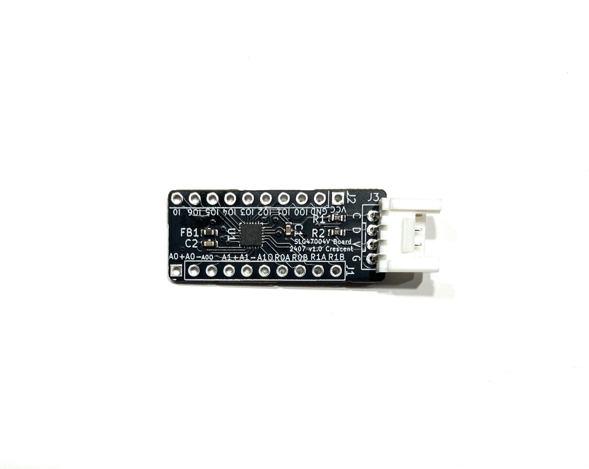
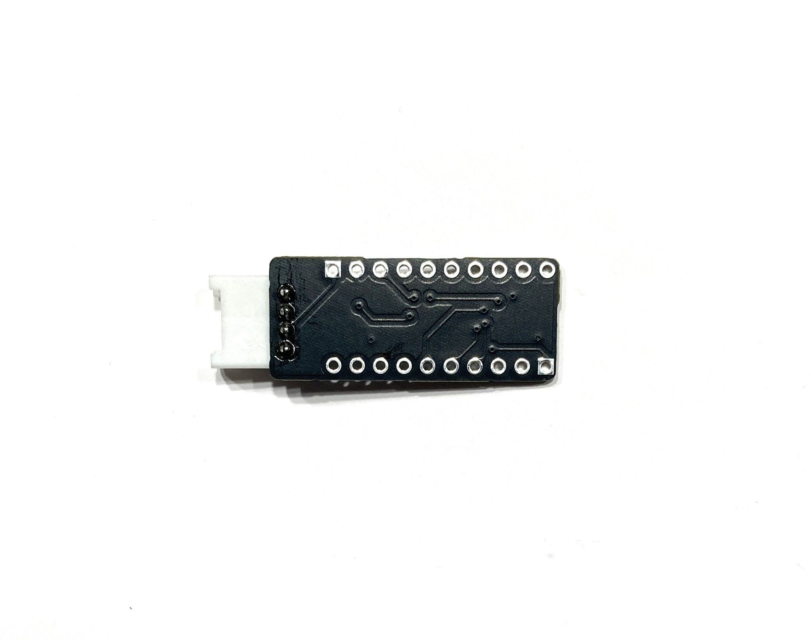
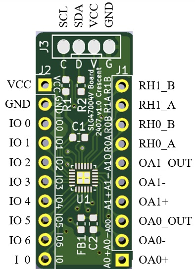

# SLG47004V変換基板　SLG47004V Board

## 概要 
  * GreenPAK [SLG47004V][1]を搭載した変換基板です 
  * オペアンプ、デジタルレオスタット、EEPROM、アナログおよびデジタルマクロセルを備えています    
  * I2Cを介して機能を何度も書き換えることが可能です(最大1000回程度)    
  * SLG47004Vの全てのIOにアクセスすることが可能です  
  * I2CはGrove互換コネクタを搭載しています
  * LED点滅のサンプルプロジェクト及びバイナリを用意しています(市販LEDをIO2に接続)
  * 同じ書き換え可能なタイプのSLG46826に比べてSLG47004Vはアナログ系が強化されています  
 

## 仕様  
  * 開発は無料のソフトウェア[Go Configure Software Hub][2]を使用してください  
  * 書き込みは[純正プログラマ][3]、[Arduino][4]もしくは[USBシリアルI2C変換基板とWebツール][5]を使用してください  
  * デジタル電源とアナログ電源は内部のFBで接続されています
  * 電源電圧DC2.5V~5.0V(絶対定格2.4V~5.5V)
  * サイズ30mm x13mm (突起部、コネクタ除く)

## 外観

[1]: https://www.renesas.com/ja/products/programmable-mixed-signal-asic-ip-products/greenpak-programmable-mixed-signal-products/analogpak/slg47004-programmable-mixed-signal-matrix-system-programmability-and-advanced-analog-features
[2]: https://www.renesas.com/ja/software-tool/go-configure-software-hub
[3]: https://www.renesas.com/ja/products/programmable-mixed-signal-asic-ip-products/greenpak-programmable-mixed-signal-products/slg4dvkgsd-greenpak-serial-debugger-board-gsd
[4]: https://www.renesas.com/ja/document/apn/cm-255-slg468246-mtp-arduino-programming-example
[5]: https://meerstern.github.io/web_serial_greenpak_writer.html

